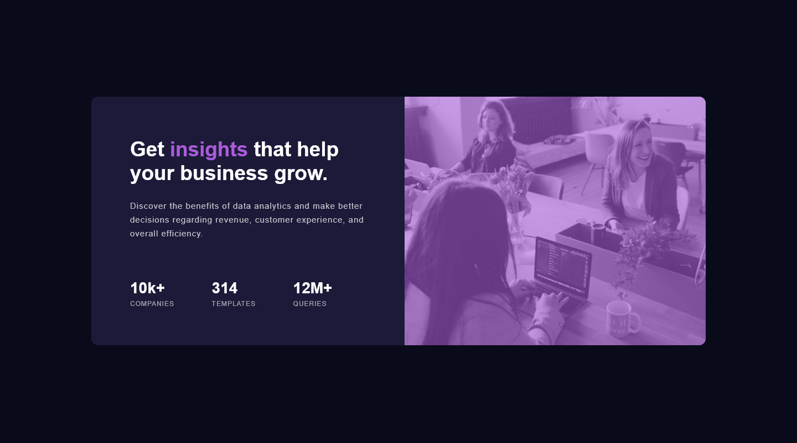

# Frontend Mentor - Stats preview card component solution

This is a solution to the [Stats preview card component challenge on Frontend Mentor](https://www.frontendmentor.io/challenges/stats-preview-card-component-8JqbgoU62). Frontend Mentor challenges help you improve your coding skills by building realistic projects. 

## Table of contents

- [Overview](#overview)
  - [The challenge](#the-challenge)
  - [Screenshot](#screenshot)
  - [Links](#links)
- [My process](#my-process)
  - [Built with](#built-with)
  - [What I learned](#what-i-learned)
  - [Continued development](#continued-development)
  - [Useful resources](#useful-resources)
- [Author](#author)
- [Acknowledgments](#acknowledgments)


## Overview

### The challenge

Users should be able to:

- View the optimal layout depending on their device's screen size

### Screenshot




### Links

- Solution URL: [Github](https://github.com/uvdevelop26/stats-preview-card-component)
- Live Site URL: [Github Pages](https://uvdevelop26.github.io/stats-preview-card-component/)

## My process

### Built with

- Semantic HTML5 markup
- CSS custom properties
- Flexbox
- Mobile-first workflow


### What I learned

La propiedad "flex" es una abreviatura para definir cómo un elemento flexible (un hijo de un contenedor con display:flex) va a crecer, encogerse y su tamaño inicial dentro del espacio disponible.

To see how you can add code snippets, see below:


```css
.container {
   flex: 0 0 49%; 
}
```

### Continued development

I will continue focusing in the learning of flexbox which is importan for developing and perfecting a layout.


## Author

- Website - [Porfolio Web](https://porfolio-uvbusiness.netlify.app/)
- Frontend Mentor - [@uvdevelop26](www.frontendmentor.io/profile/uvdevelop26)
- Linkedin - [Ubaldo Villalba](https://www.linkedin.com/in/ubaldo-villalba/)

